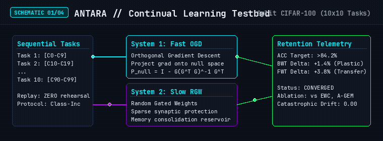

# Suryaansh Prithvijit Singh

**Founder @ [AirBorne](https://airbornehrs.in)** · AI Researcher & Systems Software Engineer  
*Bangalore, India* · [LinkedIn](https://www.linkedin.com/in/suryaansh-prithvijit-singh/) · [X (@Suryaansh07)](https://twitter.com/Suryaansh07) · [connect.singha@gmail.com](mailto:connect.singha@gmail.com)

---

I build and research deep learning systems from mathematical first principles—specializing in continual learning architectures, custom neural models built from scratch, and high-performance backend systems.

### 🔬 Selected Research & Architectures

  

 

* **[ANTARA // NeurIPS Testbed](https://github.com/Ultron09/NeurIPS)** — Evaluation testbed for continual learning under Split CIFAR-100. Implements sequential learning across 10×10 tasks without raw data rehearsal, benchmarking OGD and RGW dual-system architectures against EWC, ER, and A-GEM.
* **[Numpy-Transformer](https://github.com/Ultron09/Numpy-Transformer)** — Pure NumPy implementation of an autoregressive GPT built from scratch. Features manual backpropagation, multi-head self-attention, and custom Adam optimizer with zero high-level framework dependencies.
* **[Vision-Transformer-Diffusion](https://github.com/Ultron09/Vision-transformer-diffusion)** — Minimal ViT + DDPM diffusion pipeline built from scratch in NumPy, featuring a simplified ViT-UNet and AdaLN time conditioning.
* **[MSOPT](https://github.com/Ultron09/MSOPT) & [LOB](https://github.com/Ultron09/LOB)** — Multi-Scale Overlapping Pattern Tokenization and Limit Order Book (LOB) quantitative modeling for financial time-series forecasting.
* **[C_Language_model](https://github.com/Ultron09/C_Language_model)** — Minimal, dependency-free Transformer architecture implemented in pure C.

### ⚡ Merged Open Source Contributions

Direct contributions merged into upstream production codebases:

* **[NVIDIA / Megatron-LM](https://github.com/NVIDIA/Megatron-LM/pull/6982)** — Fixed FP32 model parameter shard detachment in `DistributedOptimizer`.
* **[Hugging Face / transformers](https://github.com/huggingface/transformers/pulls?q=is%3Apr+author%3AUltron09+is%3Amerged)**:
  * [#48014](https://github.com/huggingface/transformers/pull/48014) — Fixed Blackwell GPU crash with `torch._grouped_mm` MoE kernel on PyTorch <= 2.8.
  * [#48053](https://github.com/huggingface/transformers/pull/48053) — Fixed `convert_to_rgb` channel slicing and alpha blending for RGBA videos.
  * [#47971](https://github.com/huggingface/transformers/pull/47971) — Resolved documentation build CI startup dependencies.
* **[Microsoft / vscode](https://github.com/microsoft/vscode/pull/335945)** — Fixed terminal-editor shift-drop event handling on detached window instances.
* **[OpenAI / codex-security](https://github.com/openai/codex-security/pull/738)** — Fixed authentication state recognition in Codex client CLI.
* **[sqliteai / warp](https://github.com/sqliteai/warp/pull/41)** — Implemented AVX-512 VBMI SIMD kernel and vector quantization dispatch slot.
* **[rwkv-rs / transformers-rwkv](https://github.com/rwkv-rs/transformers-rwkv/pull/9)** — Co-authored integration for RWKV architecture in Hugging Face Transformers.

*(Active upstream patch development ongoing in [pytorch/pytorch](https://github.com/pytorch/pytorch/pull/194499), [vllm-project/vllm](https://github.com/vllm-project/vllm/pull/52865), and [google/flax](https://github.com/google/flax)).*

### 🛠️ Core Stack

* **Systems & Languages:** C++, C, Python, TypeScript, CUDA, Linux, Bash
* **Machine Learning:** PyTorch, NumPy, JAX / Flax, OpenCV, Scikit-Learn
* **Infrastructure & Backend:** Docker, Redis, Next.js, Node.js, PostgreSQL, Supabase

 

  

---

  

